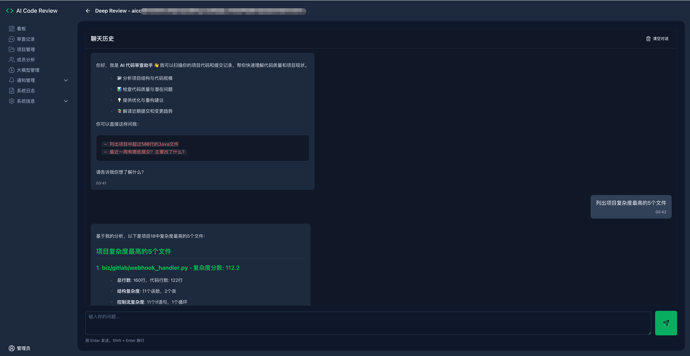
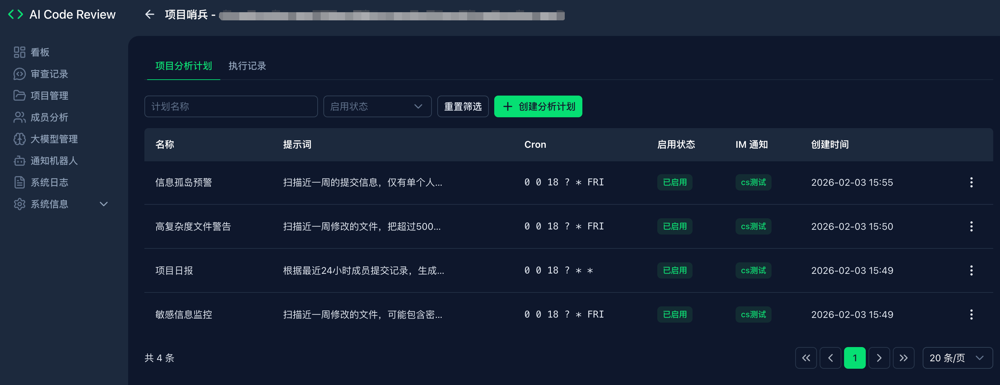

# AI Codereview Pro版

功能更加丰富强大的Code Review、项目管理工具

## 功能说明

### 🎯更丰富、友好可视化看板

**多维数据看板：** 提供丰富、直观的可视化界面，打造团队专属的效能洞察中心

### ⚙️ 智能评审引擎

**灵活触发机制：** 支持按项目自定义代码评审触发规则（Merge Request 或 Push 事件），适配多样化研发流程。

**大模型集成中心：** 提供统一的可视化界面，便捷集成与管理多款主流大语言模型（LLM），打造企业专属AI能力矩阵

### 🤖 智能通知体系

**全渠道机器人中心：** 一站式管理钉钉、飞书、企业微信等平台通知机器人，支持各项目独立绑定与消息模板定制

**精准信息触达：** 实现关键信息的智能化分发与精准推送，提升团队协同效率

### 🎨 开发者体验优化

**双主题视觉系统：** 提供完整的浅色（Light）与深色（Dark）主题模式，满足不同场景下的视觉偏好

### 📊 深度分析与洞察

**成员效能分析：** 多维对比团队成员提交行为与贡献度，量化评估研发效能

**Deep Review智能分析：** 通过自然语言与项目深度交互，获取代码库整体架构与质量洞察

**项目哨兵系统：** 定时自动化分析项目健康状态，生成结构化报告并推送至指定渠道，实现项目状态的可视化追踪与预警


**多种统计图**


**成员提交分析** 


**Deep Review** 


**项目哨兵** 


## 体验站

地址: [https://demo.mzfuture.com](https://demo.mzfuture.com)

## 部署

### 1. 准备环境
- 创建目录
```aiignore
mkdir -p {data,logs}
```

- 一般场景（推荐）：创建docker-compose.yml文件

```yaml
services:
  mysql:
    image: mysql:8.0.44
    container_name: codereview-mysql
    environment:
      MYSQL_ROOT_PASSWORD: u9QdPyXM
      MYSQL_DATABASE: codereview
      TZ: Asia/Shanghai
    command:
      --character-set-server=utf8mb4
      --collation-server=utf8mb4_general_ci
      --explicit_defaults_for_timestamp=1
      --lower_case_table_names=1
    volumes:
      - ./data/mysql:/var/lib/mysql
    healthcheck:
      test: ["CMD", "mysqladmin", "ping", "-h", "localhost", "-pu9QdPyXM"]
      interval: 5s
      timeout: 3s
      retries: 10
      start_period: 30s
    restart: unless-stopped

  app:
    image: registry.cn-hangzhou.aliyuncs.com/stanley-public/ai-codereview-pro:1.3.1
    container_name: codereview-app
    ports:
      - "81:80"
    environment:
      APP_USERNAME: admin
      APP_PASSWORD: admin
      DB_HOST: mysql
      DB_PORT: 3306
      DB_NAME: codereview
      DB_USERNAME: root
      DB_PASSWORD: u9QdPyXM
      TZ: Asia/Shanghai
    volumes:
      - ./data:/app/data
      - ./logs:/app/logs
    depends_on:
      mysql:
        condition: service_healthy
    restart: unless-stopped
```
- 特殊场景 创建docker-compose.yml文件（适用存在2级路由，例如你的gitlab主站域名为x.x.com/gitlab）：
- 原理：通过nginx劫持ai-codereview-pro应用的访问，强行加入/gitlab
```
services:
  mysql:
    image: mysql:8.0
    container_name: codereview-mysql
    privileged: true
    environment:
      MYSQL_ROOT_PASSWORD: u9QdPyXM
      MYSQL_DATABASE: codereview
      TZ: Asia/Shanghai
    command:
      - --character-set-server=utf8mb4
      - --collation-server=utf8mb4_general_ci
    volumes:
      - ./data/mysql:/var/lib/mysql
    restart: unless-stopped
    networks:
      - internal
  app:
    image: registry.cn-hangzhou.aliyuncs.com/stanley-public/ai-codereview-pro:1.3.1
    container_name: codereview-app
    privileged: true
    ports:
      - "81:80"
    environment:
      APP_USERNAME: admin
      APP_PASSWORD: admin
      DB_HOST: mysql
      DB_PORT: 3306
      DB_NAME: codereview
      DB_USERNAME: root
      DB_PASSWORD: u9QdPyXM
    volumes:
      - ./data:/app/data
      - ./logs:/app/logs
    depends_on:
      - mysql
    restart: unless-stopped
    networks:
      - internal
  proxy:
    image: nginx:1.29.3-alpine3.22-slim
    container_name: codereview-proxy
    volumes:
      - ./nginx.conf:/etc/nginx/nginx.conf:ro
      - ./certs:/etc/nginx/certs:ro
    ports:
      - "443:443"
    restart: unless-stopped
    networks:
      internal:
        aliases:
          - x.x.com
networks:
  internal:
    driver: bridge

```
特殊场景 中的nginx.conf

```
events {}
http {
    upstream real_gitlab {
        # 把 <REAL_IP> 换成 x.x.com 的真实地址
        server 192.168.1.2:443;
    }

    server {
        listen 443 ssl;
        server_name x.x.com;

        ssl_certificate     /etc/nginx/certs/server.crt;
        ssl_certificate_key /etc/nginx/certs/server.key;

        location / {
            # 统一加 /gitlab 前缀
            rewrite ^(.*)$ /gitlab$1 break;

            proxy_pass https://real_gitlab;
            proxy_ssl_verify        off;   # 自签/内网必需
            proxy_ssl_server_name   on;
            proxy_set_header Host   x.x.com;
            proxy_set_header X-Real-IP $remote_addr;
            proxy_connect_timeout   10s;
        }
    }
}
```

### 2. 启动服务
```bash
docker-compose up -d
```

### 3. 访问管理后台
打开浏览器，访问 http://localhost:81 ，使用用户名 `admin` 和密码 `admin` 登录。

### 4. 系统配置

按照实际情况，在系统内增加项目、大模型、通知机器人等信息。

## 配置代码库 Webhook (以Gitlab为例)

### 1. 创建Access Token

方法一：在 GitLab 个人设置中，创建一个 Personal Access Token。

方法二：在 GitLab 项目设置中，创建Project Access Token

### 2. 配置 Webhook

在 GitLab 项目设置中，配置 Webhook：

- URL：http://your-server-ip:81/review/webhook
- Trigger Events：勾选 Push Events 和 Merge Request Events (不要勾选其它Event)
- Secret Token：上面配置的 Access Token(可选)

### 3. 测试 Webhook

在Gitlab Webhook配置页面, 选择"Test" -> "Push Events"

### 到管理后台查看结果
