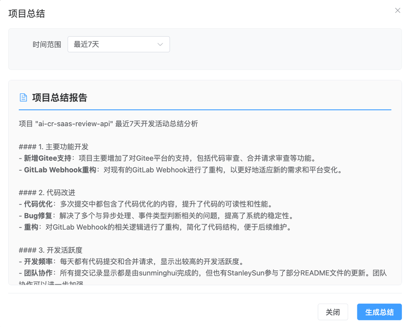
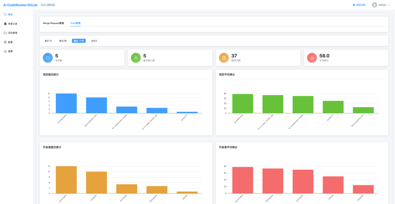
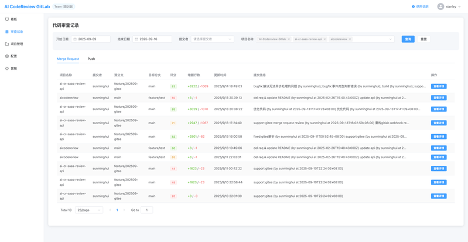

## AI Code Review SaaS 版简介

无需安装部署，注册即用的云端代码审查服务，让代码质量守护变得简单高效。

### 🚀 核心特性

- 生成项目总结报告；AI 自动生成7天、14天、1个月、2个月、3个月的项目总结报告。
- 更丰富的可视化 Dashboard
- 多平台通知集成：按项目配置钉钉、飞书、企业微信等IM通知群组。
- 精细化管理：按项目配置IM通知群、Review Style、扩展名白名单等

### 🌐 更多平台支持
- GitLab 全版本支持
- GitHub 无缝集成
- Gitee 国内优化体验

### 🎯 快速开始

**3步开启智能代码审查之旅：**

1. 访问：[https://cr.mzfuture.com](https://cr.mzfuture.com)

2. 注册：10秒快速注册，立即体验

3. 创建项目：连接您的代码仓库，开始享受智能审查

### 截图

#### 项目总结报告

#### 可视化 Dashboard

#### 审查日志
